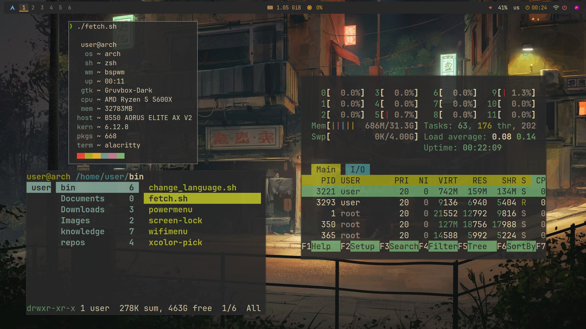

<h1 align="center"> 💦 Arch Linux Dotfiles 💦 </h1>

<!-- INFORMATION -->
<h1 align="left"> 🌐 About</h1> 



</br>

 - OS: [**`Arch Linux`**](https://archlinux.org/)
 - WM: [**`BSPWM`**](https://github.com/baskerville/bspwm)
 - Bar: [**`Polybar`**](https://github.com/polybar/polybar)
 - Compositor: [**`Picom`**](https://github.com/yshui/picom)
 - Terminal: [**`Alacritty`**](https://github.com/alacritty/alacritty)
 - App Launcher: [**`Rofi`**](https://github.com/davatorium/rofi)
 - Notify Daemon: [**`Dunst`**](https://github.com/dunst-project/dunst)
 - Shell: [**`zsh`**](https://github.com/zsh-users/zsh)

</br>

<!-- HOTKEYS -->
## 💻 HotKeys
* **Open the terminal** - `super + enter`
* **Switch the layout** - `shift + alt`
* **Open the application menu** - `super + d`
* **Recognize the color on the screen** - `super + shift + x`
* **Launch Firefox** - `super + f`
* **Close the window that is in focus** - `super + w`
* **Take a screenshot** - `print`
* **Restart bspwm** - `ctrl + shift + r`
* **Switch to another desktop** - `super + 1/6`
* **Move the window to another desktop** - `super + shift + 1/6`
* **Switch the window to floating mode** - `super + space`

The other hotkeys are in `~/.config/sxhkd/sxhkdrc`.


## 📣 Guide

### **archinstall**

* **install optional packages:** `git iwd`

### Internet connection
* **Ethernet  → does not need to do anything**

### bash
```sh 
iwctl

[iwd] station list
[iwd] station get-networks "adapter"
[iwd] station "adapter" connect "SSID_network"
### (wait 10-15 seconds)
[iwd] quit